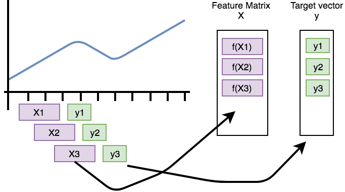
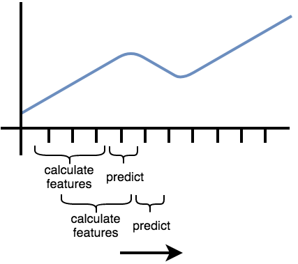
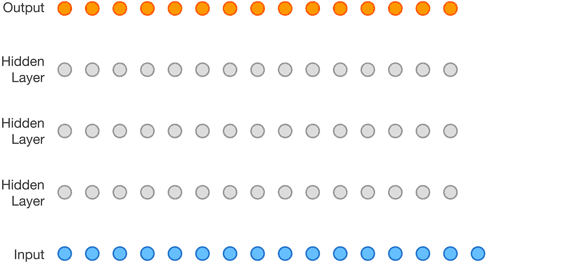
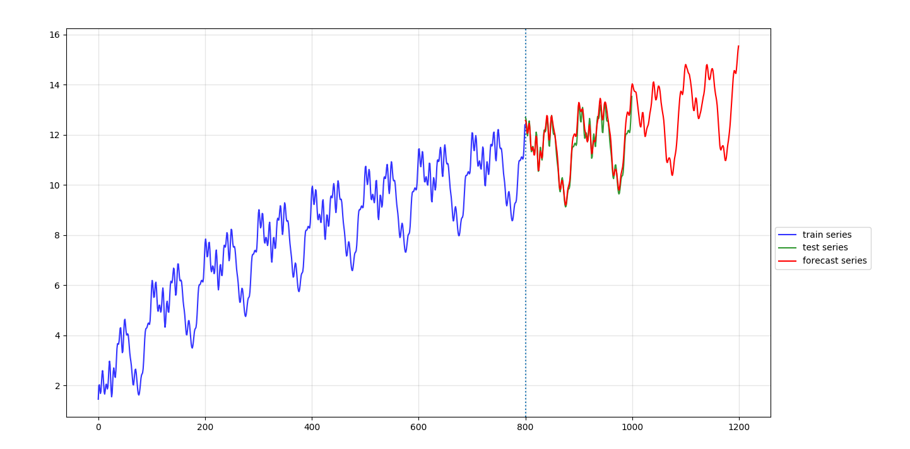
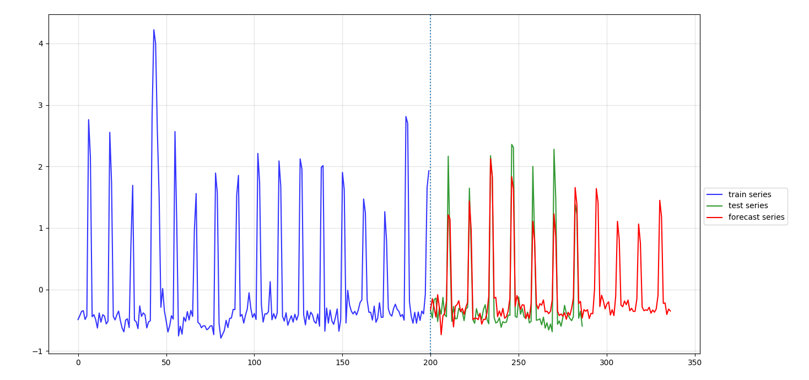

# 多步时间序列预测

完成时间序列的多步预测需要三点：
1. 数据预处理实现
2. 预测模型的实现、训练、优化
3. 多步预测算法的实现

这三点应该分离实现。

第一点关注数据的清洗、变换等。具体可见 [time-series-utils](https://github.smartx.com/zhiwen/time-series-utils)
第二点根据场景需求而定，模型可能是机器学习模型，也可能是深度学习模型。不存在通用的模型能满足所有的场景。预测结果的好坏取决于模型的实现、训练优化。

本项目则是实现第三点，多步时间序列预测。

## 原理

- 随参数 t 变化的思路
- 自回归思路 （连续）
- binnize, beam search (概率化)，根据采样定理还原模拟信号

思路如下

时间序列数据没有带标注, 而带监督的机器学习学习模型的训练需要定义输入与输出, 那么怎么把时间序列数据转化为带标注的形式呢？首先把原始序列（预处理后）化成带标注形式，



我们称它为自监督标注。这种做法在 `NLP` 中训练 `RNN` 十分普遍，只不过我们把它引入到时序预测中。时间窗口的大小以超参数的形式存在，也可以考虑自动化地确定时间窗口的大小。


预测时，通过滑动一个固定的窗口完成多步预测，



如果使用的预测模型是神经网络，则没有显式的特征计算过程。


从 `deepmind` [wavenet](https://deepmind.com/blog/article/wavenet-generative-model-raw-audio) 一动画更直观理解多步预测，



## 演示

`tsforecast` 内置一个带两个隐层的前馈神经网络，用于演示

非线性预测效果：



来自 `dogfood` 的性能指标预测：




## 使用

根据场景和需求设计你的模型或特征函数并实现如下接口：

```python
class ModelBase:

    """
    1. 关注场景本身，根据场景定义模型，如果是机器学习模型，则关注特征函数
    2. 关注如何训练与优化模型的实现
    3. 无状态，确定的输入，确定的输出，不随时间、操作变化
    4. 模型持久化
    """

    def fit(self, X, y, epochs=None, batch_size=None, validation_rate=0):
        # validation_rate
        # 输入的数据中，取部分作为验证集合，通常用在 callback 中
        pass

    def predict(self, X):
        pass

    def reset(self):
        # 清空模型权重
        pass

    @property
    def window_size(self):
        # 返回滑动窗口的大小
        # window_size 作为一个超参数，像 batch_size 一样关乎模型的预测效果
        return self._window_size
```


使用你的模型以及具体的数据进行预测：

```python
from tsforecast import TimeSeriesForecaster

model = YourModel(window_size, your_params)
series = load_your_data()
fr = TimeSeriesForecaster(model)
fr.fit(series, epochs=100, batch_size=50, validation_rate=0)
pred_series = fr.forecast(n_steps=100)
```


实际情况可能还涉及交叉验证、数据预处理等。可参考 `examples` 下两个例子。


## TODO

1. 支持多维时序预测
2. 分离模型实现到 tsmodels
3. 实现膨胀卷积, pure Attention
4. 概率化模型的实现