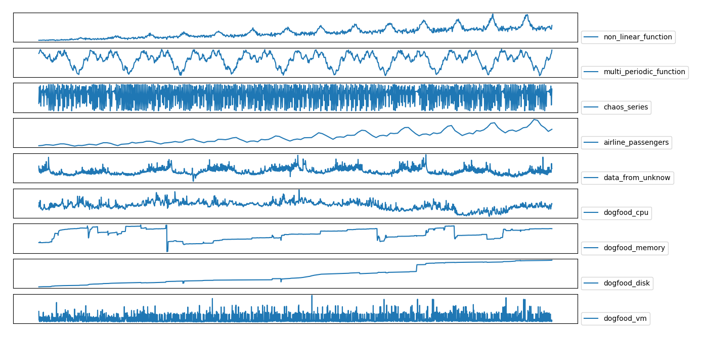
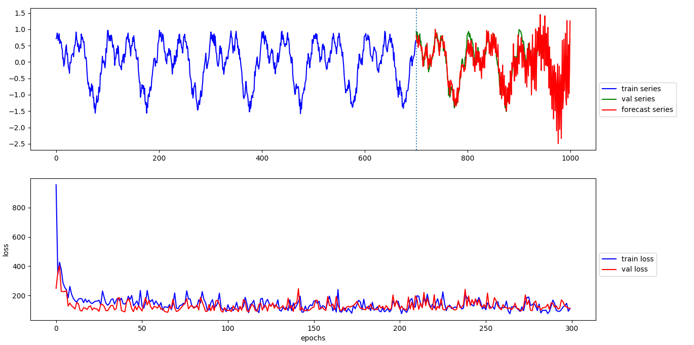
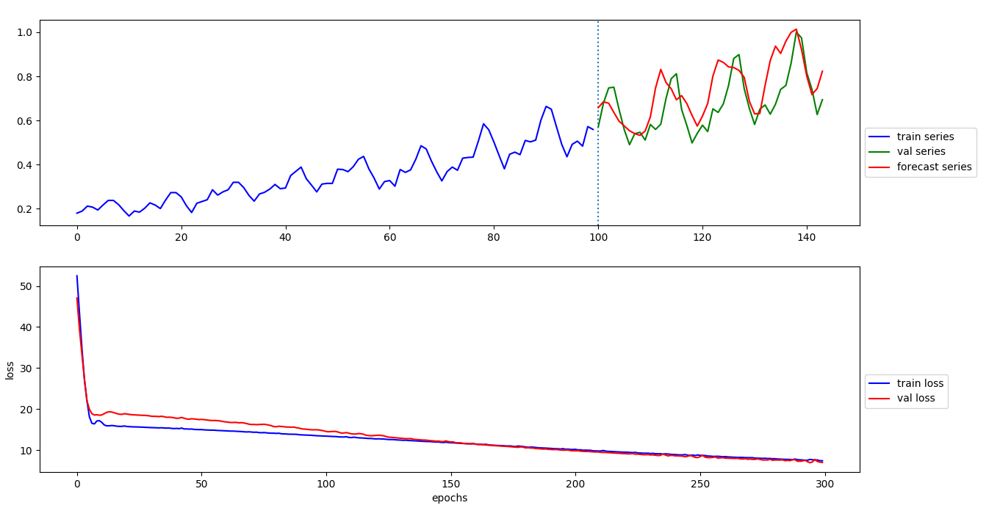
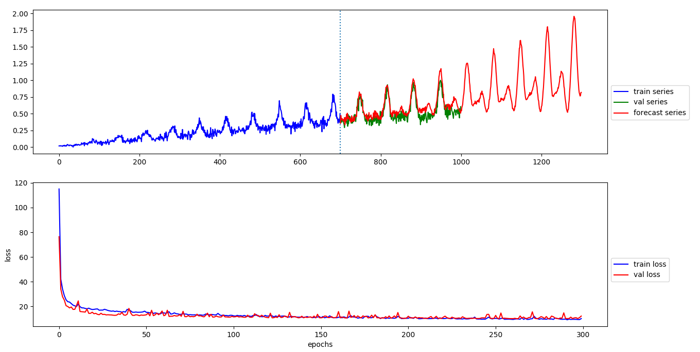
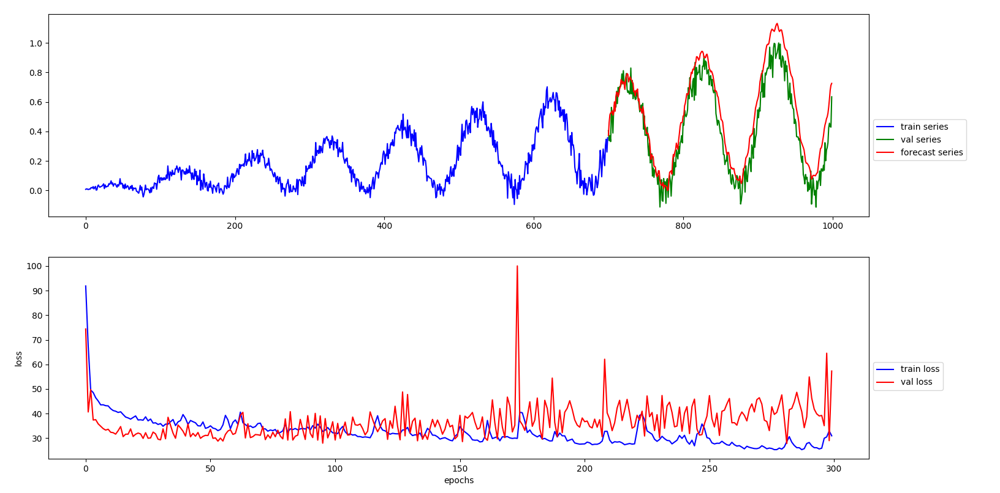
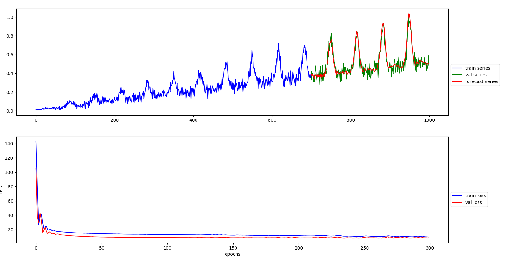
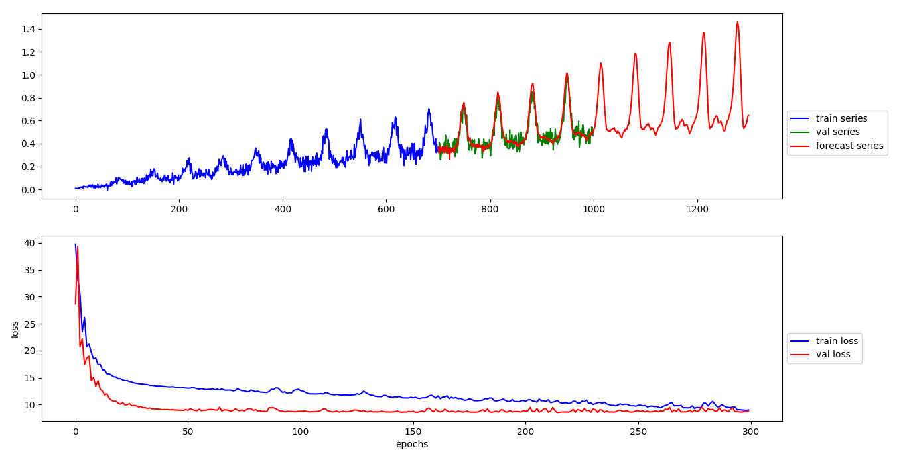
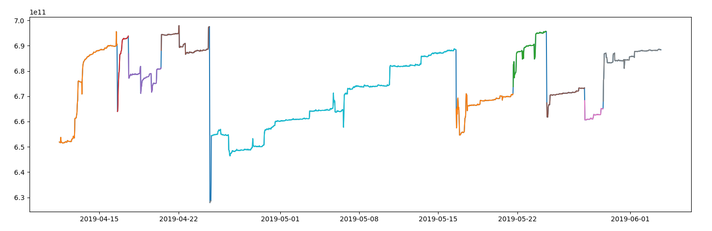

# time-series-forecast

本项目实现基于机器学习和深度学习的时间序列预测, 通过训练多个模型, 以一定的组合策略(Bestone or Combiantion) 组合各模型的预测结果.

组合策略目前有两种:

1. 选择模型中的 topk 进行 forecast combination
2. 选择模型中的 top one 进行 forecast

进行时序预测建模我们使用如下模型:

1. 线性模型
2. 集成模型(XGBoost)
3. ARIMA
4. Prophet(Facebook开源的预测工具)
5. 前馈神经网络
6. 卷积神经网络
7. 循环神经网络

## prediction .vs. forecast

prediction 和 forecast 并不是完全相等的概念. prediction 范畴更大, forecast 则处理带时间步的 prediction.

## 基本原理

时间序列预测(forecasting)有两类方法:

1. 时间外推
2. 自回归

时间外推: 建立当前时间戳到与之对应的取值的映射(可以使用统计学方法或机器学习模型), 即 y <- f(t) 的形式. 预测新值外推时间戳即可.

自回归: 建立历史值与当前值的映射(同样可以使用统计学方法或机器学习模型), 即 yt <- f(yt-1, yt-2, ...). 预测新值通过递归方式进行.

时间外推法有很大的局限性, 仅能捕捉到时序中的长期依赖关系. 因此, 接下的建模我们值使用自回归方法. 

### 转化为带标注数据

时间序列数据没有带标注, 而带监督的机器学习学习模型的训练需要定义输入与输出, 那么怎么把时间序列数据转化为带标注的形式呢？

从自会回出发, 时序之间存在自回归关系, 那么, 我们可以把它转化为带标注形式的数据:

### preprocessing

原始时序中包含大量噪声, 可以使用如下方法去噪:

1. 平滑法
2. 数字滤波器

此外, 还要通过白噪声检验或[随机游走检验](https://en.wikipedia.org/wiki/Random_walk_hypothesis)检验数据是否可预测.

### features

1. 普通特征 (统计特征、拟合特征、分类特征)
2. dtw & wavelet
3. autocorrelation
4. reprecentation learning (深度学习自动特征提取)

目前运用到预测中的特征包括：最大值、最小值、mean、median、方差、标准差、kurtosis、skewness 等等

更丰富的时序特征提取模块见[时间序列特征提取](.md), 该模块包括了特征重要性评估

1~3 的特征提取通过滑动窗口的方式进行,滑动步长通常为 1. 4 为深度学习中的自动特征提取方法, 通过我们会使用 CNN 提取局部特征, LSTM 提取长期依赖特征.下面会展开这方面方法.

特征重要性评估

### 使用统一的评估指标

统一使用 MAPE 作为模型的评估指标.

### 训练与预测

建模方法：

1. 机器学习
2. 机器学习 + 集成方法
3. 深度学习
4. 深度学习 + combination (并行化训练)

多时间步预测策略：

1. 直接输出所需时间步
2. 递归输出所需时间步
3. 混合策略

我们使用第二点: 递归输出所需时间步

递归预测示意图如下:

或者我们使用动态方式展示：

### 处理过拟合

1. 谱正则化 & L1 L2
2. EarlyStopping
3. callback save best model
4. 权重滑动平均

谱正则化是从L约束中推导出来, 可以看做是L2正则化的加强版本. 使用时我们直接把它嵌入到隐层中.

EarlyStopping 通过监控模型训练的收敛情况, 提早跳出不收敛或面临过拟合的训练.

最后通过每一个 epoch 比较上一个 epoch 的验证效果, 选择做好的模型保存. 预测则是使用最好的模型保存.

权重滑动平均提高训练的稳定性.
  
## 数学与基本概念

使用数学方法建模进行时间序列预测有如下思路：

1. 基于均方误差的多项式拟合
2. 基于对增长率的变化进行微分方程建模
3. 统计方法 (频率主义方法 & 贝叶斯方法)(统计学方法依旧可以使用滑动窗口方法)
4. 随机过程与谱分析

魏尔斯特拉斯逼近定理表明在给定区间上的连续函数可以使用多项式去逼近，但用到预测上并不好使：

1. 数据有噪声，多项式逼近容易过拟合
2. 龙格现象，高次多项式在区间边缘出现剧烈的震荡

魏尔斯特拉斯逼近定理只是函数可以使用多项式逼近的存在性证明，没有告诉我们如何寻找这样的多项式. 我们可能会想，可以使用泰勒级数或傅里叶级数(使用有线的正弦波的叠加逼近拟合函数, 但是会出现吉布斯现象).

更严重的是, 多项式在外推时面临爆炸性(预测值变为无穷)的问题

总结：

- 多项式的最小二乘问题，龙格现象
- 三角级数的最小二乘问题，吉布斯现象

## 数据

训练与检验模型的数据集:

## linear

在滑动窗口提取特征的基础上, 我们实现线性模型, 预测效果如下

多周期预测效果:

趋势+多周期预测效果:

趋势+周期:

如何确定输入的大小？因为我们需要模型学习到数据中潜在的规律（增长、周期）

## mlp (单隐层前馈神经网络)

MLP 在时间序列预测中的实现可以看做是非线性自回归模型,

基于 MLP 的预测效果演示1：

基于 MLP 的预测效果演示2：

基于 MLP 的预测效果演示3：

基于 MLP 的预测效果演示4：

## cnn

CNN 的训练效率对比于 MLP 很慢, 目前先不加入模型集合中.

## lstm

LSTM 的训练效率比 MLP 更慢, 目前先不加入模型集合中.

## ensemble

ensemble 进行时序预测的思路是先对非平稳序列进行平稳化, 然后使用 ensemble 相关的模型进行训练
与预测, 把预测结果再转化为原来的非平稳序列.

平稳序列 + XGBoost

## 误差估计

误差是多少取决于我们多大程度上接受错误, 换句话说, 我们容忍多大概率实际取值并没有落到预测区间上。

长时间步预测的问题

## 应用

1. 资源类指标的预测
2. 性能类指标预测

其他时间序列问题

我们从 octopus 获取的数据有不同的使用阶段, 我们需要算法对时序数据进行分割

解决思路：

1. 数学分析
2. 统计学 (k-s test MLE MAPE)
3. 机器学习

时序分割示例1 (dogfood 内存)：

时序分割示例2 (dogfood 存储空间)：

参考[时间序列特征工程repo](url)

## TODO

参考[TODO](url)

## 参考

1. https://otexts.com/fpp2/
