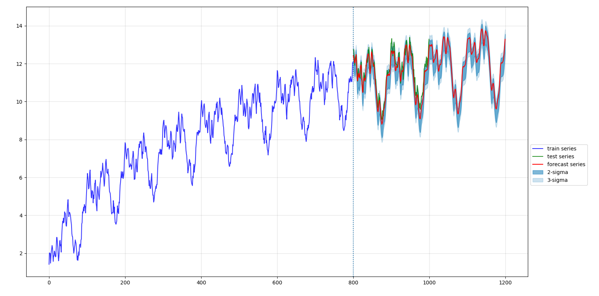
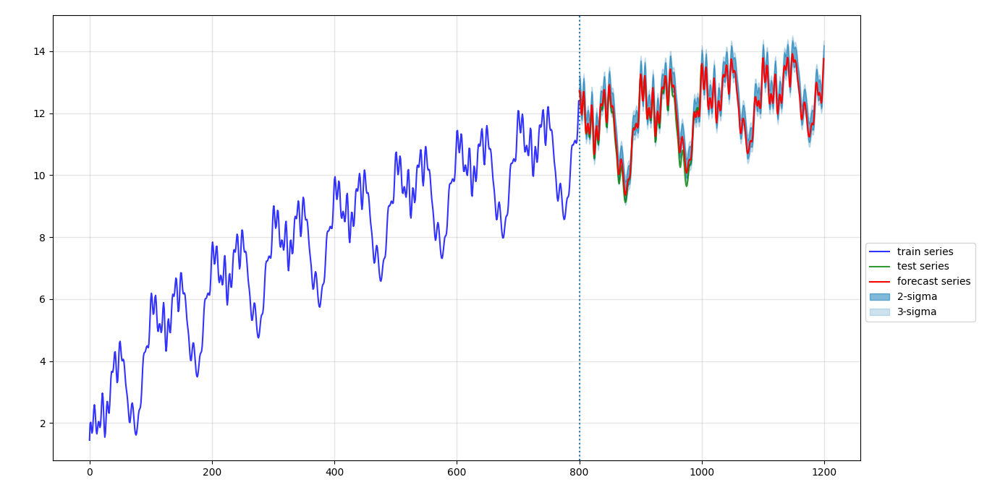
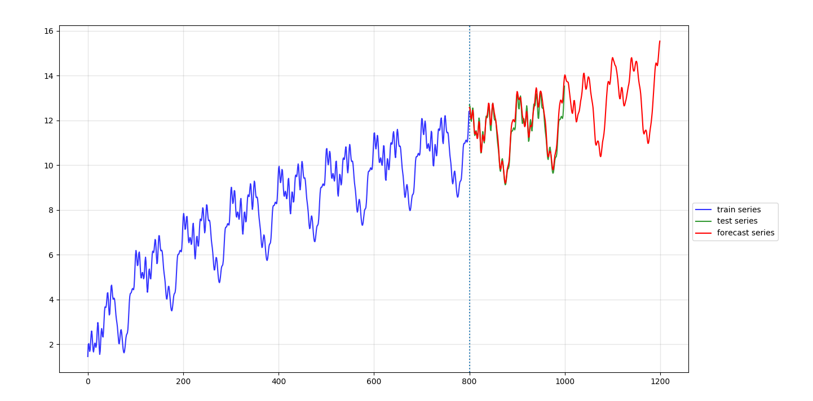
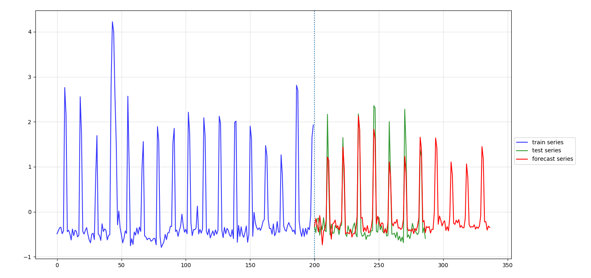

# tsforecast

基于滑动窗口进行时间序列多步预测的工具。


## 演示


一下的演示均使用tsforecast内置一个带两个隐层的前馈神经网络作为训练模型，


示例一：



示例二：



示例三：



示例四：




## 安装


本项目只依赖`numpy`、`keras`等常用工具库，非常轻量。

克隆项目到`{your_path}`，

```bash
git clone https://github.com/allenwind/time-series-forecast.git
```

打开`.bashrc`添加项目路径到`PYTHONPATH`环境变量中，

```.bashrc
export PYTHONPATH={your_path}/time-series-forecast:$PYTHONPATH
```

然后，

```bash
source ~/.bashrc
```

然后可以跑一下`examples/tests.py`下的例子。


## 使用


根据场景和需求设计你的模型或特征函数并实现如下接口：

```python
class ModelBase:

    """
    1. 关注场景本身，根据场景定义模型，如果是机器学习模型，则关注特征函数
    2. 关注如何训练与优化模型的实现
    3. 无状态，确定的输入，确定的输出，不随时间、操作变化
    4. 模型持久化
    """

    def fit(self, X, y, epochs=None, batch_size=None, validation_rate=0):
        # validation_rate
        # 输入的数据中，取部分作为验证集合，通常用在 callback 中
        pass

    def predict(self, X):
        pass

    def reset(self):
        # 清空模型权重
        pass

    @property
    def window_size(self):
        # 返回滑动窗口的大小
        # window_size 作为一个超参数，像 batch_size 一样关乎模型的预测效果
        return self._window_size
```


使用你的模型以及具体的数据进行预测：

```python
from tsforecast import TimeSeriesForecaster

model = YourModel(window_size, your_params)
series = load_your_data()
fr = TimeSeriesForecaster(model)
fr.fit(series, epochs=100, batch_size=50, validation_rate=0)
pred_series = fr.forecast(n_steps=100)
```


实际情况可能还涉及交叉验证、数据预处理等。可参考 `examples` 下两个例子。


