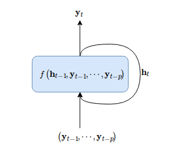

# 原理和解释

## 原理

以下是 ARMA 模型

$$
X_{t}=c+\varepsilon_{t}+\sum_{i=1}^{p} \varphi_{i} X_{t-i}+\sum_{i=1}^{q} \theta_{i} \varepsilon_{t-i} \tag{1}
$$

AR 部分如下:

$$
X_{t}=c+\varepsilon_{t}+\sum_{i=1}^{p} \varphi_{i} X_{t-i}
$$

它表示过去 p 个时间值的加权和与当前取值有关.

MA 部分如下:

$$
X_{t}=\varepsilon_{t}+\sum_{i=1}^{q} \theta_{i} \varepsilon_{t-i} \tag{1}
$$

在我们的预测应用中, 使用滑动窗口的形式把原始数据转化为带标注的监督形式数据:

每个滑动窗口的值可如下表示:

$$
\mathbf{x}_{i}=[X(i), X(i+1), \ldots, X(i+p-1)]
$$

每个窗口对应的标签如下:

$$
y_{i} = X(i+p)
$$

把滑动窗口展开成矩阵的表示如下:

$$
\begin{pmatrix}
y_{t-p-2} & ... & ... & y_{t-3} & y_{t-2}\\ 
y_{t-p-1} & ... & ... & y_{t-2} & y_{t-1}\\ 
y_{t-p} & ... & ... & y_{t-1} & y_{t}\\ 
y_{t-p+1} & ... & ... & y_{t} & y_{t+1}
\end{pmatrix} \tag{2}
$$

p 是我们选择的特征窗口大小. q 又时间序列长度决定. (注意不是 ARMA 模型中的 p,q)

也就是说， 模型的输入为如下形式：

$$
X_{q,p} = 
\begin{pmatrix}
y_{t-p-q+1} & ... & ... & y_{t-q}\\ 
... & ... & ... & ...\\ 
y_{t-p} & ... & ... & y_{t-1}\\ 
y_{t-p+1} & ... & ... & y_{t}
\end{pmatrix} \tag{3}
$$

模型的输出为如下形式：

$$
y = 
\begin{pmatrix}
y_{t-q+1}\\ 
...\\ 
y_{t}\\ 
y_{t+1}
\end{pmatrix} \tag{4}
$$

因此， 滑动窗口本质上是非线性 AR 模型，表达如下

$$
\mathbf{y}_{t+1}=f\left(\mathbf{y}_{t}, \mathbf{y}_{t-1}, \cdots, \mathbf{y}_{t-p+1}\right) \tag{5}
$$

这个 $f$ 就是我们要训练的模型， 如神经网络， XGBoost. 如果不考虑输出，这个结构可以看着时间序列的 encoder。

当它为线性模型时， 就化成我们常见的自回归模型. 为直观表示, 可以写成矩阵形式:

$$
\left[\begin{array}{c}{y_{1}} \\ {y_{2}} \\ {y_{3}} \\ {\vdots} \\ {y_{t}}\end{array}\right]=\left[\begin{array}{cccc}{y_{0}} & {y_{-1}} & {y_{-2}} & {\dots} \\ {y_{1}} & {y_{0}} & {y_{-1}} & {\dots} \\ {y_{2}} & {y_{1}} & {y_{0}} & {\dots} \\ {\vdots} & {\vdots} & {\vdots} & {\ddots} \\ {y_{t-1}} & {y_{t-2}} & {y_{t-3}} & {\cdots}\end{array}\right]\left[\begin{array}{l}{f} \\ {f} \\ {f} \\ {\vdots} \\ {f}\end{array}\right]
$$

实际上，训练模型前还有特征提取阶段, 把模型和特征提取函数写成复合函数形式：

$$
\mathbf{y}_{t+1}=f \circ g \left(\mathbf{y}_{t}, \mathbf{y}_{t-1}, \cdots, \mathbf{y}_{t-p+1}\right) \tag{6}
$$

模型训练和特征提取可以表达成复合函数形式. 依赖关系体现在时间窗口中，模型尝试学习这种依赖关系。

这种模型有一定的局限, 就是学习长期依赖, 为此, 可以改成如下形式:

$$
\mathbf{y}_{t} , \mathbf{h}_{t}=f\left(\mathbf{h}_{t-1}, \mathbf{y}_{t-1}, \cdots, \mathbf{y}_{t-p}\right) \tag{5}
$$

结构如下:

它包括两部分: 循环结构和自回归. 这不就是循环神经网络吗!

因此, 我们使用的方法本质上可以分为两类:

1. 线性自回归, 非线性自回归 (Linear XGBoost MLP)
2. 带反馈的非线性自回归 (LSTM)

## 各种预测模型的本质

时间序列能否预测的本质不在于使用的模型和数学技巧, 而在于数据本身. 如何数据本身是随机生成或随机游走, 那么根本没有预测意义. 当然有一点要注意, 计算机生成的随机数是伪随机数, 从数学上看是一个非线性动力系统, 而根据循环神经网络的万能拟合定理, 它能够模拟任意非线性动力系统, 因此不排除 RNN 等网络结构能把伪随机数生成的规律学习下来. 但是, 现实场景下, 不存在这种情况.

那么, 现在的问题是, 如何度量时间序列的可预测性?

首先我们分析下, 所谓预测只根据历史和当前数据预测未来的状态, 也就是说历史数据中蕴含了未来的状态信息.假定我们有时间窗口:

$$
\mathbf{w}_{i}=[X(i), X(i+1), \ldots, X(i+p-1)]
$$

其蕴含的信息必定和下一个时间窗口是相关的:

$$
\mathbf{w}_{i+1}=[X(i+1), X(i+2), \ldots, X(i+p)]
$$

那么我们可以定义滑动时间窗口内数据的相关性来刻画(度量)时间序列的可预测性. 分析这一点我们可以从信息论角度出发.

[参考ApEn]

因此, 数据本身决定预测的上限, 模型和特征工程以及预处理技巧只是逼近这个上限.

## 参考资料

[Nonlinear autoregressive exogenous model](https://en.wikipedia.org/wiki/Nonlinear_autoregressive_exogenous_model)
